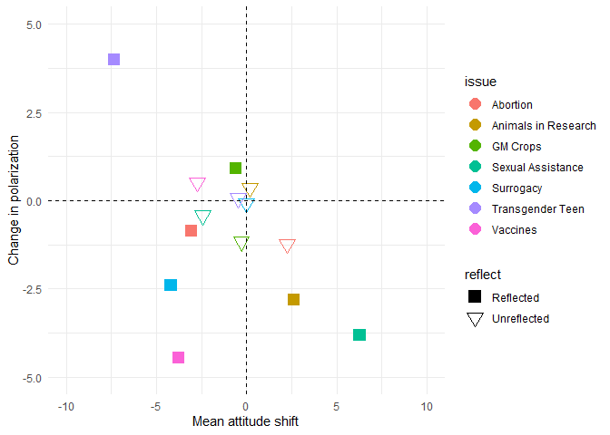

How Consequentialist Reasoning Shapes Bioethical Views
================
Piotr Bystranowski, Jon Rueda, & Ivar R. Hannikainen
2022-02-08

We initially drafted 14 normative and 16 factual statements regarding
eleven controversial issues in contemporary bioethics (see Supplementary
Table ??). We recruited a politically-balanced sample (N = 140) of U.K.
residents via Prolific. Each participant was presented with all 30
statements in a randomized order and asked to report their agreement or
disagreement using a slider. On the basis of this pretest, we selected
pairs of normative/factual statements (one concerning the same issue),
by applying three criteria:

1.  the absolute value of the Pearson’s correlation coefficient between
    responses regarding the normative and factual statements in a given
    pair exceeds .3;

2.  the distribution of responses regarding the normative (and, to a
    smaller extent, factual) statement in a given pair resembles a
    bimodal distribution;

3.  the responses regarding the normative (and, to a smaller extent,
    factual) statement in a given pair exhibit some correlation with
    political attitudes on the social dimension (a single-item measure).

<table class=" lightable-paper" style="font-family: &quot;Arial Narrow&quot;, arial, helvetica, sans-serif; margin-left: auto; margin-right: auto;">
<caption>
Seven selected pairs of normative-factual statements (before
reverse-scoring)
</caption>
<thead>
<tr>
<th style="text-align:left;">
Issue
</th>
<th style="text-align:left;">
Type
</th>
<th style="text-align:right;">
Mean
</th>
<th style="text-align:right;">
SD
</th>
<th style="text-align:right;">
Fact-Norm correlation
</th>
<th style="text-align:right;">
Shapiro-Wilk test
</th>
<th style="text-align:right;">
Correlation with politics
</th>
</tr>
</thead>
<tbody>
<tr>
<td style="text-align:left;">
Abortion
</td>
<td style="text-align:left;">
Factual
</td>
<td style="text-align:right;">
48.70
</td>
<td style="text-align:right;">
27.70
</td>
<td style="text-align:right;">
-0.59
</td>
<td style="text-align:right;">
0.95
</td>
<td style="text-align:right;">
-0.30
</td>
</tr>
<tr>
<td style="text-align:left;">
Abortion
</td>
<td style="text-align:left;">
Normative
</td>
<td style="text-align:right;">
55.28
</td>
<td style="text-align:right;">
29.81
</td>
<td style="text-align:right;">
-0.59
</td>
<td style="text-align:right;">
0.95
</td>
<td style="text-align:right;">
0.35
</td>
</tr>
<tr>
<td style="text-align:left;">
Animals in Research
</td>
<td style="text-align:left;">
Factual
</td>
<td style="text-align:right;">
55.37
</td>
<td style="text-align:right;">
30.21
</td>
<td style="text-align:right;">
0.77
</td>
<td style="text-align:right;">
0.92
</td>
<td style="text-align:right;">
0.15
</td>
</tr>
<tr>
<td style="text-align:left;">
Animals in Research
</td>
<td style="text-align:left;">
Normative
</td>
<td style="text-align:right;">
47.33
</td>
<td style="text-align:right;">
29.65
</td>
<td style="text-align:right;">
0.77
</td>
<td style="text-align:right;">
0.94
</td>
<td style="text-align:right;">
0.12
</td>
</tr>
<tr>
<td style="text-align:left;">
GM Crops
</td>
<td style="text-align:left;">
Factual
</td>
<td style="text-align:right;">
61.67
</td>
<td style="text-align:right;">
22.54
</td>
<td style="text-align:right;">
-0.77
</td>
<td style="text-align:right;">
0.96
</td>
<td style="text-align:right;">
-0.08
</td>
</tr>
<tr>
<td style="text-align:left;">
GM Crops
</td>
<td style="text-align:left;">
Normative
</td>
<td style="text-align:right;">
35.38
</td>
<td style="text-align:right;">
26.79
</td>
<td style="text-align:right;">
-0.77
</td>
<td style="text-align:right;">
0.94
</td>
<td style="text-align:right;">
0.21
</td>
</tr>
<tr>
<td style="text-align:left;">
Sexual Assistance
</td>
<td style="text-align:left;">
Factual
</td>
<td style="text-align:right;">
64.70
</td>
<td style="text-align:right;">
21.83
</td>
<td style="text-align:right;">
0.36
</td>
<td style="text-align:right;">
0.92
</td>
<td style="text-align:right;">
-0.23
</td>
</tr>
<tr>
<td style="text-align:left;">
Sexual Assistance
</td>
<td style="text-align:left;">
Normative
</td>
<td style="text-align:right;">
44.75
</td>
<td style="text-align:right;">
25.93
</td>
<td style="text-align:right;">
0.36
</td>
<td style="text-align:right;">
0.96
</td>
<td style="text-align:right;">
-0.30
</td>
</tr>
<tr>
<td style="text-align:left;">
Surrogacy
</td>
<td style="text-align:left;">
Factual
</td>
<td style="text-align:right;">
46.28
</td>
<td style="text-align:right;">
21.00
</td>
<td style="text-align:right;">
-0.34
</td>
<td style="text-align:right;">
0.96
</td>
<td style="text-align:right;">
-0.10
</td>
</tr>
<tr>
<td style="text-align:left;">
Surrogacy
</td>
<td style="text-align:left;">
Normative
</td>
<td style="text-align:right;">
76.44
</td>
<td style="text-align:right;">
23.28
</td>
<td style="text-align:right;">
-0.34
</td>
<td style="text-align:right;">
0.86
</td>
<td style="text-align:right;">
-0.21
</td>
</tr>
<tr>
<td style="text-align:left;">
Transgender Teen
</td>
<td style="text-align:left;">
Factual
</td>
<td style="text-align:right;">
83.22
</td>
<td style="text-align:right;">
15.72
</td>
<td style="text-align:right;">
0.53
</td>
<td style="text-align:right;">
0.90
</td>
<td style="text-align:right;">
0.20
</td>
</tr>
<tr>
<td style="text-align:left;">
Transgender Teen
</td>
<td style="text-align:left;">
Normative
</td>
<td style="text-align:right;">
67.62
</td>
<td style="text-align:right;">
32.43
</td>
<td style="text-align:right;">
0.53
</td>
<td style="text-align:right;">
0.86
</td>
<td style="text-align:right;">
0.53
</td>
</tr>
<tr>
<td style="text-align:left;">
Vaccines
</td>
<td style="text-align:left;">
Factual
</td>
<td style="text-align:right;">
22.23
</td>
<td style="text-align:right;">
20.83
</td>
<td style="text-align:right;">
0.46
</td>
<td style="text-align:right;">
0.88
</td>
<td style="text-align:right;">
0.26
</td>
</tr>
<tr>
<td style="text-align:left;">
Vaccines
</td>
<td style="text-align:left;">
Normative
</td>
<td style="text-align:right;">
51.15
</td>
<td style="text-align:right;">
31.12
</td>
<td style="text-align:right;">
0.46
</td>
<td style="text-align:right;">
0.94
</td>
<td style="text-align:right;">
0.20
</td>
</tr>
</tbody>
</table>

To allow for a consistent and meaningful interpretation of the employed
measures in the studies to follow, we chose to reverse-score some items,
employing the following criteria:

-   reverse-score *normative* statements so that all of them correlate
    positively with the measure of social political attitudes (so that a
    higher score for a given item indicates social conservatism of the
    respondent);

-   reverse-score *factual* statements so that all of them correlate
    positively with the corresponding normative statement,

    <table class=" lightable-paper" style="font-family: &quot;Arial Narrow&quot;, arial, helvetica, sans-serif; margin-left: auto; margin-right: auto;">
    <caption>

    Interpretation of employed items, after reverse-scoring. Statements
    in brown are reverse-scored when compared to the version seen by
    participants

    </caption>
    <thead>
    <tr>
    <th style="text-align:left;">

    Issue

    </th>
    <th style="text-align:left;">

    Normative

    </th>
    <th style="text-align:left;">

    Factual

    </th>
    </tr>
    </thead>
    <tbody>
    <tr>
    <td style="text-align:left;font-weight: bold;font-style: italic;">

    Abortion

    </td>
    <td style="text-align:left;font-style: italic;">

    The human fetus has a
    right to life.

    </td>
    <td style="text-align:left;font-style: italic;">

    The human fetus is
    capable of experiencing pain \[by the second trimester or
    earlier\].

    </td>
    </tr>
    <tr>
    <td style="text-align:left;font-weight: bold;font-style: italic;">

    Animals in Research

    </td>
    <td style="text-align:left;font-style: italic;">

    Animal testing (e.g.,
    with mice, rabits, guinea pigs) in biomedical research is morally
    acceptable.

    </td>
    <td style="text-align:left;font-style: italic;">

    Animal testing is
    necessary to guarantee the safety of biomedical developments.

    </td>
    </tr>
    <tr>
    <td style="text-align:left;font-weight: bold;font-style: italic;">

    GM Crops

    </td>
    <td style="text-align:left;font-style: italic;">

    Governments should ban
    all genetically modified crops developed for human
    consumption.

    </td>
    <td style="text-align:left;font-style: italic;">

    Genetically modified
    crops are unfit for human consumption.

    </td>
    </tr>
    <tr>
    <td style="text-align:left;font-weight: bold;font-style: italic;">

    Sexual Assistance

    </td>
    <td style="text-align:left;font-style: italic;">

    Governments shoud not
    subsidize sexual assistance to meet the needs of disabled
    individuals.

    </td>
    <td style="text-align:left;font-style: italic;">

    Paid sexual assistance
    would not help meet the needs of disabled individuals

    </td>
    </tr>
    <tr>
    <td style="text-align:left;font-weight: bold;font-style: italic;">

    Surrogacy

    </td>
    <td style="text-align:left;font-style: italic;">

    Surrogate motherhood
    should be illegal.

    </td>
    <td style="text-align:left;font-style: italic;">

    It is likely that
    surrogate mothers are being exploited.

    </td>
    </tr>
    <tr>
    <td style="text-align:left;font-weight: bold;font-style: italic;">

    Transgender Teens

    </td>
    <td style="text-align:left;font-style: italic;">

    Parents should be
    allowed to veto transgender teens’ choice to undergo certain medical
    procedures (e.g., to receive puberty blocking drugs

    </td>
    <td style="text-align:left;font-style: italic;">

    The average teenager is
    mature enough to decide whether to undergo irreversible surgeries
    \[at 15 years of age or later\].

    </td>
    </tr>
    <tr>
    <td style="text-align:left;font-weight: bold;font-style: italic;">

    Vaccines

    </td>
    <td style="text-align:left;font-style: italic;">

    If a parent is concerned
    about vaccinating their children, they should have the right to
    refuse to vaccinate them.

    </td>
    <td style="text-align:left;font-style: italic;">

    The side-effects caused
    by modern vaccines are frequent and severe.

    </td>
    </tr>
    </tbody>
    </table>

## Study 1a: Consequentialist Reflection

In this exploratory study, we examined the effect of reflection by
asking study participants to reflect on a given issue and produce a
short argumentative text. We employed a set of normative/factual
statement pairs regarding 7 notable, possibly morally controversial
issues. We examined the effect of reflection by asking participants to
express (on a closed scale) their attitude towards each of the 7
normative statements twice. Before the second time, they were also asked
to ponder a factual statement (matching one of the normative statements)
and write a short description of arguments they would use to support
their view on that factual statement.

### Methods

146 U.K. nationals recruited on Prolific completed both parts of the
study (Age = 34 years; 83 women; 65 participants declared right-wing
political views). The study consisted of two sessions. In the first
session, participants were asked to express their attitude towards each
of the seven factual or normative (depending on condition) statements
using a 100-point slider labeled at both extremes and both tertiles. For
each statement, participants were also asked to express their confidence
in the provided answer. They also answered a few basic demographic
questions. After a seven-day delay, participants returned to take part
in the second wave of the study. Each participant was presented with one
randomly selected factual (Reflection condition) statement, and were
asked to reflect for at least 45 seconds on what they believe and the
reasons for believing it. Participants recorded their attitude on a
100-point soldier. They were informed that they would be asked to
explain their point of view to others. On the next screen, participants
were asked to explain their point of view in a text box. After that,
participants were presented with the same 7 statements as in the first
session and asked to express their attitudes to each of them.

### Analysis plan

\~\~Assuming that we would observe some effects of reflection, we also
wanted to check if those effects are symmetric or asymmetric.

Hypothesis 1. *An asymmetric outcome, in contrast, would be observed if
the cognitive effort invested in reflection and/or rationalization
overall shifts the population judgment in one direction, making it, say,
more progressive rather than conservative.*

We calculated the difference between post- and pre-treatment assessments
of a given participant for a given issue. As the measures for all items
were rescaled to correlate with conservative views, a negative
difference would indicate a post-treatment left-ward shift, while a
positive difference would be associated with a rightward shift.

Hypothesis 2. *A possible symmetric setting is one in which the effect
moderates extreme attitudes and beliefs. And so, reflecting on a factual
statement regarding a given issue, people might realize they are
uncertain on whether a given activity is (or is not) harmful, thus they
might moderate their moral assessment of this issue.*

If the effect of our manipulation were to be symmetric (increased or
decreased polarization), then we would expect to observe a change in the
deviations from the median. Hence, we calculated the absolute deviation
of every observation from the (grand) median for a given item. We then
calculated the difference between post- and pre-treatment absolute
deviations for each participant/item. The resulting measure would take a
positive value if the manipulation resulted in an increased polarization
and a negative value in the case of a moderation. Finally, we aimed to
check whether the effects of reflection/rationalization are general or
domain-specific. In the adopted design, we measured the change in
beliefs and attitudes regarding 7 issues, while asking participants to
perform the rationalization/reflection task only on one of them. This
allowed us to check if any observed effect took place only with regard
to the target issue, or also for the other 6 filler issues.\~\~

### Results

<!-- -->

First, we normalized the responses within each issue subset and, second,
we calculated the difference between responses given in session 2 and
session 1 (so that a positive difference would indicate a shift in the
conservative direction on the social political scale). Then, we fitted a
series of mixed-effect models with the said difference as the dependent
measure and random effects of participant’s id and issue. An
intercept-only model revealed a non-significant negative intercept (*β*
= -0.03, *t*(999) = -1.58, *p* = 0.11). Thus, we didn’t observe evidence
that reflecting on one issue would lead to a consistent shift in
normative opinions on all 7 issues. However, adding the effect of
reflection (i.e, a binary variable indicating whether a given issue was
the reflection topic or merely one of 6 filler issues for a given
participant) improved the models fit (*χ*2(1) = 5.54), *p* =
0.019), thus suggesting that reflecting on the factual dimension of a
given issue would move the normative opinions on that issue in the
direction of political progressivism (*β* = -0.14, *t*(998) = -2.35, *p*
= 0.019).

In the second set of analyses, the dependent measure was the change in
the normalized distance from the median (with a positive score
indicating enhanced polarization). Again, we fitted a series of
mixed-effect models, with an intercept-only model providing some
inconclusive evidence of the moderating effect of reflection across the
seven issues (*β* = -0.03, *t*(145) = -1.76, *p* = 0.08). As adding the
effect of reflection didn’t improve the model’s fit (*χ*2(1)
= 0.2), *p* = 0.66), the putative moderating effect of reflection
doesn’t seem to be enhanced by focusing on the target issue.

    ##                 resp_Factual resp_Normative resp2_Factual resp2_Normative
    ## resp_Factual            1.00             NA          0.83              NA
    ## resp_Normative            NA           1.00            NA            0.82
    ## resp2_Factual           0.83             NA          1.00              NA
    ## resp2_Normative           NA           0.82            NA            1.00

## Study 1b: Rationalization

144 U.K. nationals recruited on Prolific completed both parts of the
study (Age = 38 years; 91 women; 60 participants declared right-wing
political views).

<!-- -->

### Results

We conducted a series of analyses analogical to that from Study 1a. So,
first, we fitted a series of mixed-effect models with the difference
between normalized assessments of factual statement in the second and
first series as the dependent measure and random effects of
participant’s id and issue. An intercept-only model revealed a
non-significant negative intercept (*β* = -0.03, *t*(6.0885046) = -1.39,
*p* = 0.21) and the mode’s fit wasn’t improved by adding the effect of
target issue (*χ*2(1) = 0.44), *p* = 0.508), meaning that we
didn’t observe evidence that thinking about the normative dimension of
one issue would lead to a consistent shift in factual beliefs on all 7
issues, nor a shift in specific factual beliefs on the target issue.

In the second set of analyses, the dependent measure was the change in
the normalized distance from the median. The intercept-only model
suggests an overall moderating effect of thinking about the normative
dimension of one issue on factual beliefs on all 7 issues (*β* = -0.04,
*t*(141) = -2.07, *p* = 0.04). As adding the effect of reflection didn’t
improve the model’s fit (*χ*2(1) = 0.07), *p* = 0.8), the
moderating effect of reflection doesn’t seem to be enhanced by focusing
on the target issue.
